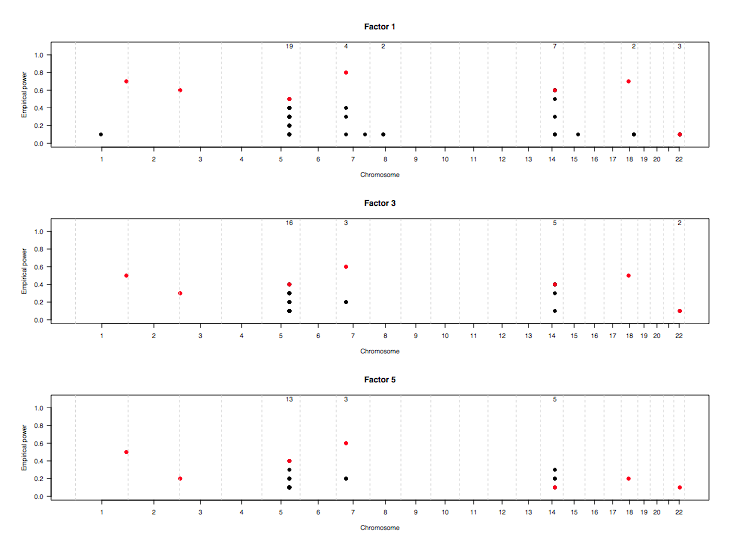
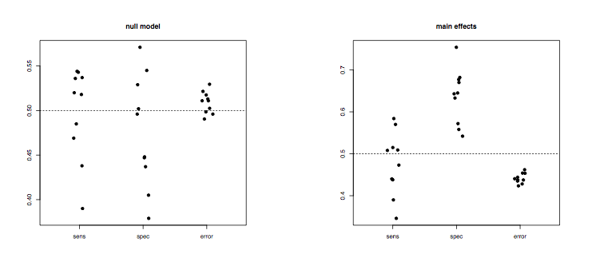
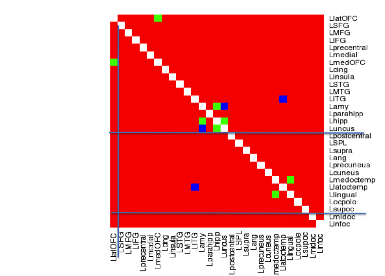
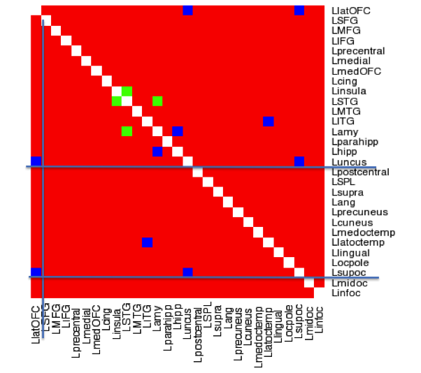
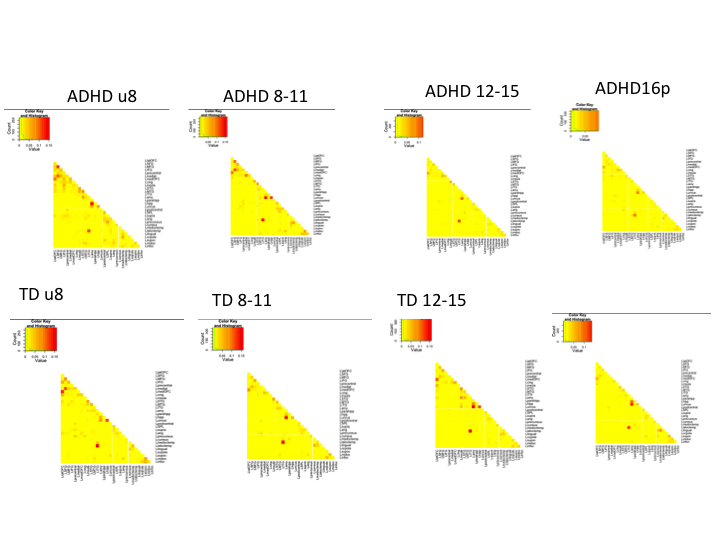
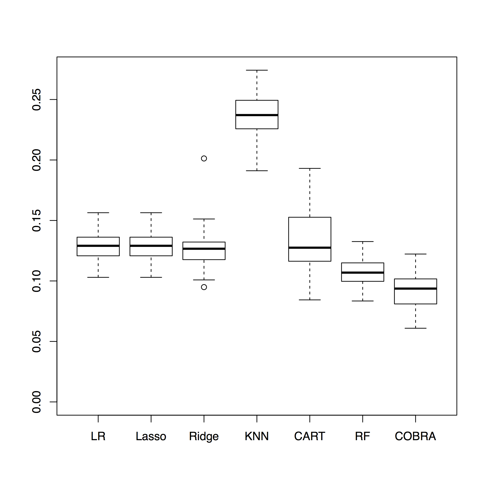
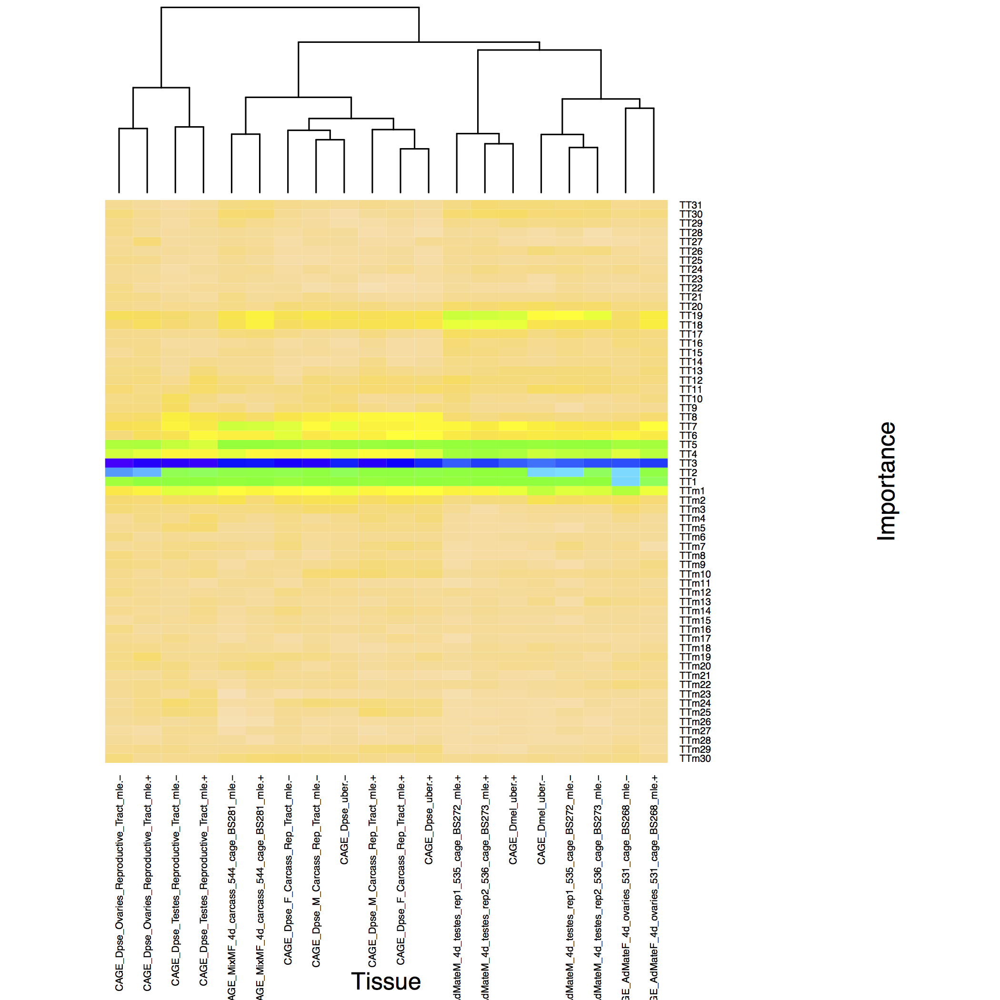
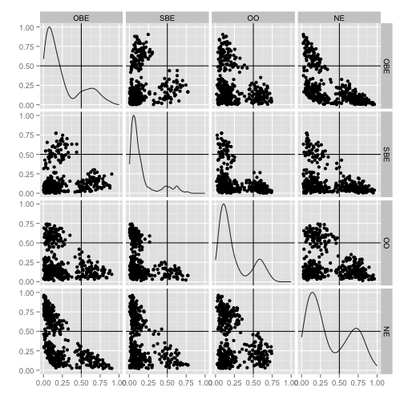
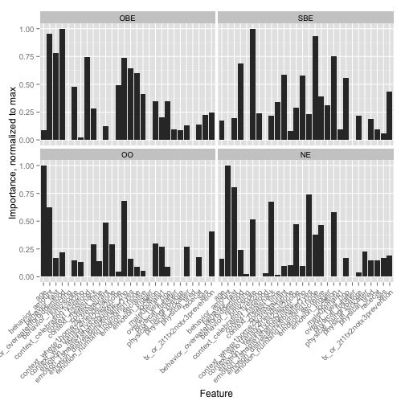
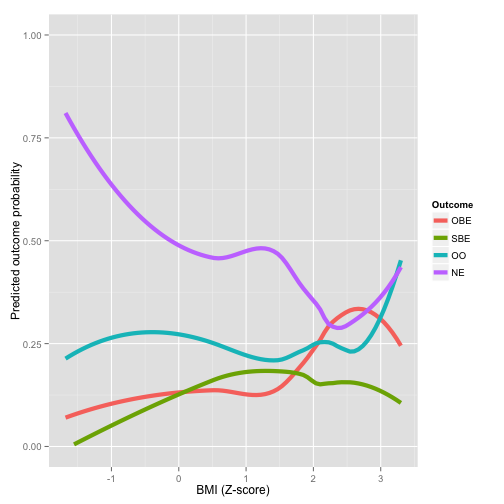

## The post-parameter ecosystem

> + The framework we have created around the concept of probability machines has led to several developments and extensions by collaborators that allow different problems to be addressed directly
> + We are creating a new ecosystem in which parametric specification of relationships in a regression setting is unnecessary and, in fact, redundant
> + Most of what follows is unpublished, so please be selective in your sharing.

--- 

## The post-parameter ecosystem

### The new nomenclature

+ Machines

  + Probability machine
  + Counterfactual machine
  + Risk machine
  
+ Interactor
+ Recurrency and probabilistic ranking
+ Entanglement maps
+ Machine collectives

  + Probability collective
  + Risk collective
  

--- .segue .dark

## Recurrency for variable selection

---

## Recurrency

This work is primarily by Silke Szymczak and Joan Bailey-Wilson at NHGRI

The basic idea 

+ Run RF repeatedly on the same dataset using different seeds 
+ Compute variable importances
+ See which variables consistently stay at the top

---

## Recurrency

---

## Recurrency

Initial experiments concentrated on filtering

We found that filtering based on a factor of the minimum absolute variable importance removed many false positives

Select variables in each run with raw importance scores > (factor) x minimum absolute importance score

Simulation with a null model and a model with 9 independent SNPs with different MAF, effect sizes and LD structure

+ 550K SNPs
+ 1000 cases and 1000 controls

---

## Recurrency

### Null model

---

## Recurrency

### Main effects model

---

## Recurrency

--- .segue .dark

## Entanglement maps

---

## Entanglement maps

This work is primarily by Dede Greenstein (NIMH) and Abhijit Dasgupta (NIAMS)

The basic idea

+ Context is large multivariate data collected on individuals (SNPs, pixels from images)
+ Predict each variable using the rest using a learning machine and compute importance scores
+ The importance score is a "metric" of the predictive strength of one variable on another in the context of the other variables

  + It accounts for the landscape
  
+ We want to capture which pairs of variables have a strong dependency on each other in a predictive sense
+ The dependency need not be symmetric, though we have implemented a symmetrized version

---

## Entanglement maps

### Comparison of brain images in childhood ADHD from different age groups 

We created entanglement maps for different regions of the brain for different age groups

We can compare the maps formally using a permutation test based on the matrix Frobenius norm

---

## Entanglement maps

---

## Entanglement maps

--- .segue .dark

## Synthetic features

---

## Synthetic features

This work is primarily by Qinxin Pan and Jason Moore (Dartmouth) and James Malley (NIH)

The basic idea

+ There is biological information about the functional relationship between groups of genes/proteins (networks)
+ We can create small learning machines using just these networks
+ We can then use these network machines as inputs (synthetic features) in a larger machine that looks at the overall landscape in predicting outcome

--- .segue .dark

## Probability collectives (COBRA)

---

## Probability collectives (COBRA)

This work is primarily by Aurelie Fischer, Benjamin Guedj and Gerard Biau (Paris) inspired by James Malley (NIH)

The basic idea

+ Mojirsheibani (1999) proposed the idea of combining classifiers such that the collective provably does better than any individual machine in the collective

  + Note that this is not an ensemble method
  
+ The Paris group, inspired by Jim, has extended this to collectives of regression machines

  + Non-trivial mathematics involved
  + Leverages work of GKKW as well as DGL
  
+ R package forthcoming in Q1

---

## COBRA

--- .segue .dark

## Scanning the genome

---

## Transcription start sites in Drosophila

This work is primarily by Anthony Fletcher and Jim Malley

The basic idea

+ Transcription start sites based on tetrameric structure of genome
+ Scan the genomic tetramers using probability machines

  + Learn from known data
  + Provide probability estimtes for start sites for entire genome

+ A new algorithm for finding the most predictive nodes in a tree/forest
+ Drosophila genome (155M)

---

## Transcription start sites in Drosophila

--- .segue .dark

## Understanding regression structures

---

## Probability machines for understanding structure

This work is primarily by Abhijit Dasgupta (NIAMS)

The basic idea

+ Run probability machines as a first pass at the data
+ The nonparametric nature of PM allows agnostic capture of the patterns in the data
+ Graphically look at marginal patterns, interactions, other interesting ideas
+ Use as a check on data quality
+ Use this as a discovery tool for further modeling and analysis

---

## Probability machines for understanding structure

### Childhood obesity and eating patterns (Yanovski, NICHD)

---

## Probability machines for understanding structure

### Childhood obesity and eating patterns (Yanovski, NICHD)

---

## Probability machines for understanding structure

### Childhood obesity and eating patterns (Yanovski, NICHD)

--- .segue .dark

## Upcoming attractions

---

## What we're working on

+ Probability machines with continuous predictors
+ Probability machines for case-control studies
+ Probability machines for clustered data

  + Repeated measures
  + Matched studies

+ Risk machines for survival studies
+ Competing risks for survival studies using synthetic features
+ Probability machines for propensity scoring

--- .segue .dark

## Acknowledgements

---

## Chefs in the kitchen

+ Jason Moore (Dartmouth) @moorejh
+ Joan Bailey-Wilson (NHGRI)
+ Silke Szymczak (NHGRI)
+ Gerard Biau (Paris)
+ Brian Oliver (NIDDK)
+ Dede Greenstein (NIMH)
+ Michael Ward (NIAMS)

